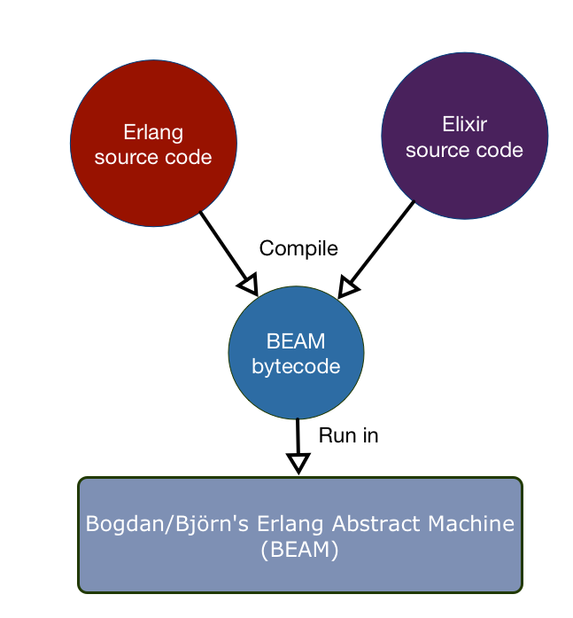
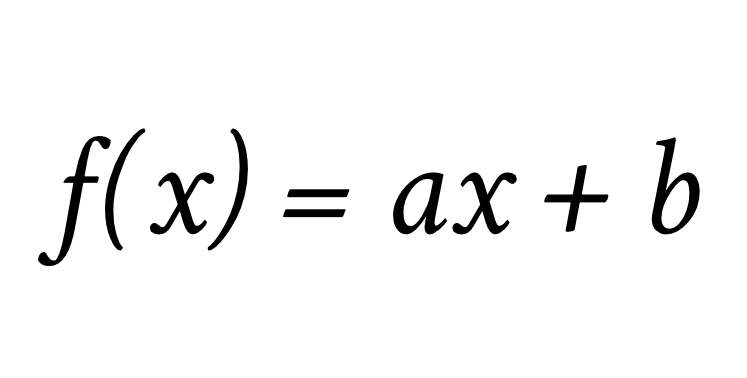
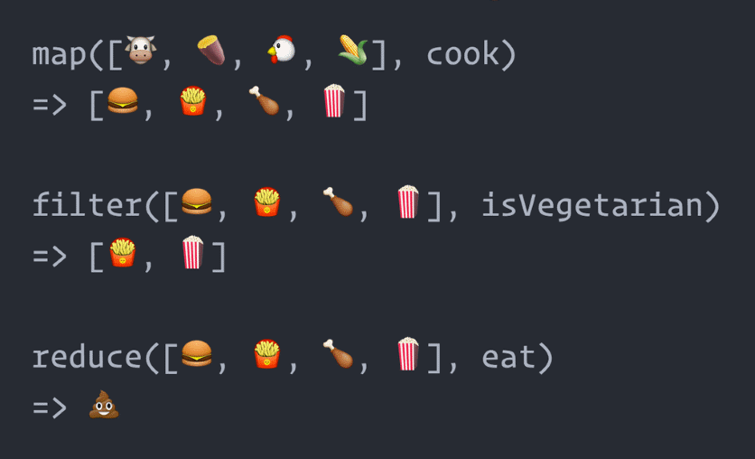
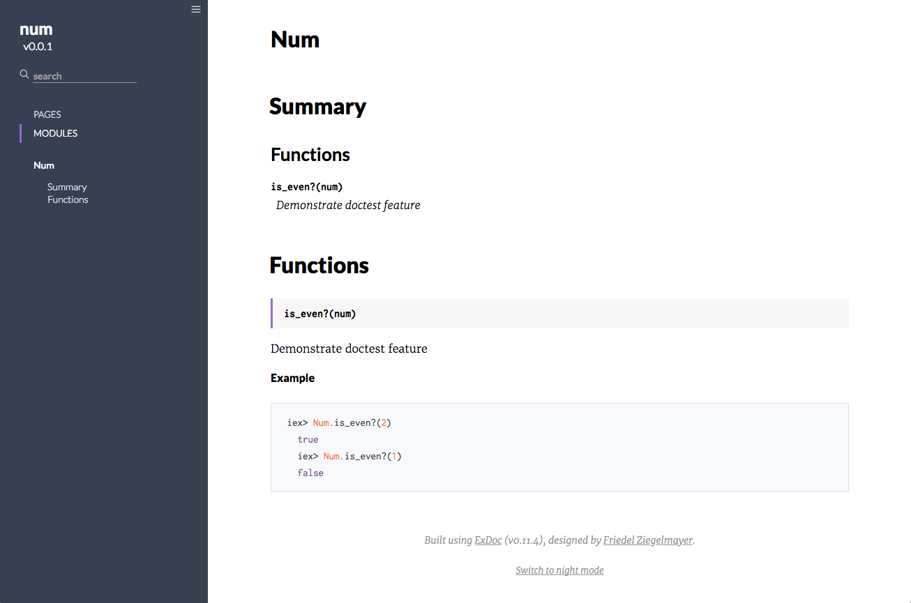
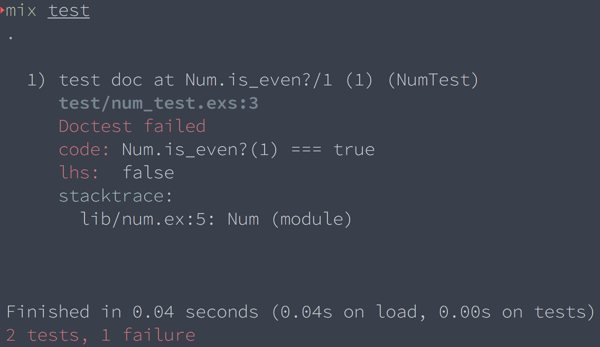
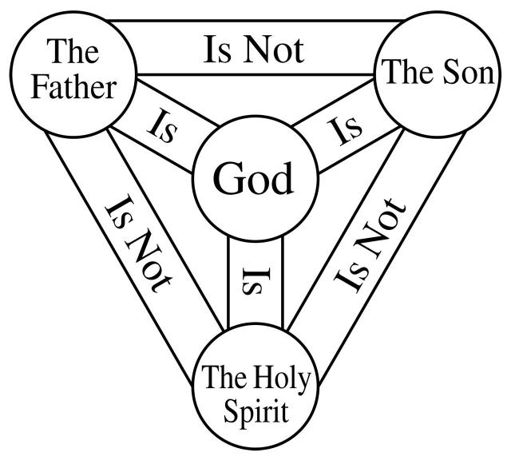

theme: Merriweather, 8


---

## Elixir.tw


https://www.facebook.com/groups/elixir.tw/
https://www.meetup.com/Taipei-Elixir-Erlang-Meetup-Group/


---

## [fit] Elixir installation party

---

[http://bit.do/elixir_install](http://bit.do/elixir_install)

---

## Levarage Erlang


---

# Distribute
## Light weight __process__

---

## Java, PHP, Python, JavaScript, Ruby
## with _multi core_ CPU


---

## _C\#_[^2]
__300µs__ per process
__50µs__ per message

## _Erlang_
__1µs__ up to 2,500 processe
__3µs__ up to 30,00 processes
__0.8µs__ per message

[^2]: 2003's data

---

> __process__ in Erlang/Elixir
> =~
> __object instance__ in OO application

---

## We do not have ONE web-server handling 2 millions sessions. We have 2 million webservers handling one session each.[^3]
- Joe Armstrong

[^3]: http://goo.gl/IlcNTF

---

# Fault-tolerant
## * Let it __crash__


---

### Update __on the fly__, literally.


---

# [fit] 2. Elixir Syntax Highlight

---

## Intuitive syntax like Ruby
```elixir
defmodule Math do
  def sum(a, b) do
    a + b
  end
end

Math.sum(1, 2)  #=> 3
```

---

# Pattern matching
## What's the "`=`" means, seriously?

---

## Pattern matching basic

```elixir
x = 1

# Ruby x, x, y = [1, 2, 3] # => x = 2, y = 3

[x, x, y] = [1, 2, 3] # => Error

[x, x, y] = [1, 1, 3] # => x = 1, y = 3

{m, "bar", n} = {"foo", "bar", "baz"} => m = "foo", n = "baz"
```

---

## Mathmatical function


---

### Pattern matching

```elixir
defmodule Factorial do
  def calc(0), do: 1
  def calc(val), do: val * calc(val - 1)
end

Factorial.calc(100)
```

---

### Pattern matching, contd.

```elixir
def parse(html =
            %{head: head = %{title: title, meta: _},
            body: body})
    when is_bitstring(title) do
    # body => "Hello world"
    # title => "foo"
    # head => %{title: "foo", meta: "bar"}
    # html => %{head: %{title: "foo", meta: "bar"}, body: "Hello world"}
end

parse(%{head: %{title: "foo", meta: "bar"}, body: "Hello world"})
```

---

# Pipe operator: `|>`

---

## Problem: _useless_ temp variable

```elixir
response = get_response(request)
body = parse_body(response, :html)
html = render(body)

html = render(parse_body(get_response(request), :html))
```

---

## Pipe operator: |>
```elixir

html =
  request
  |> get_response()
  |> parse_body(:html)
  |> render()
```

---

# Functional

---

## Map, Filter and Reduce


---

## Functional modules:

* `Enum`: `map`, `reduce`, `filter`, `zip`, `scan`
* `Stream`: lazy evaluation

---

## OTP modules:

* `GenServer`, `Supervisor`
* `Task`: Partially GenServer
* `Agent`: Another side of GenServer
* `Flow`: Back-preasure concurrent base on GenState

---

## Meta-programming:
### marco, quote, unquote

The ability to manipulate __AST__

```elixir
iex> quote do: 1 * 2 + 3

{:+, [context: Elixir, import: Kernel],
[{:*, [context: Elixir, import: Kernel], [1, 2]}, 3]}
```

---

## doctest

```elixir
defmodule Num do
  @doc """
  Demonstrate doctest feature
  ## Example
    iex> Num.is_even?(1)
    true
  """
  def is_even?(num) do
    rem(num, 2) == 0
  end
end
```

---

### doc part


---

### test part



---

## Trinity


---

# 4. Nerves
### The IOT framework of Elixir

[https://github.com/nerves-project](https://github.com/nerves-project)

---

## installation

```

```

---

## Poncho project

```
.
├── firmware
│   ├── _build
│   ├── config
│   ├── deps
│   ├── lib
│   ├── mix.exs
│   └── mix.lock.rpi3
└── ui
    ├── assets
    ├── config
    ├── deps
    ├── lib
    ├── mix.exs
    └── priv
```

---

## Barebone: Firmware

```shell
export MIX_TARGET=rpi3
mix deps.get
mix firmware
mix firmware.burn
```

---

## Wireless update

```
{:nerves_firmware_http, "~> 0.4"}
```

```
mix firmware.push 192.168.1.100 --target rpi3
```

---

# 學習資源

* Elixir.tw Facebook:
* Elixir.tw slack: https://elixirtw.herokuapp.com/

* Elixir slack
* Pragmatic bookshelf
* Manning

---

### Thanks
### Any Questions?
